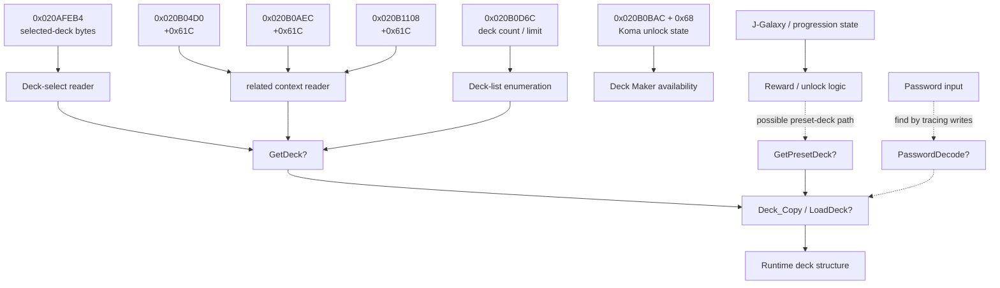
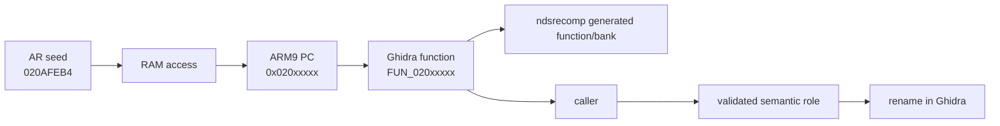

# Mining Jump Ultimate Stars Action Replay Codes to Reverse-Engineer Decks

## Executive summary

The Action Replay material gives you a much better starting point than blind RAM searching. The strongest public anchors are **`0x020AFEB4`**, repeatedly used to force deck selection; three homologous addresses at **`0x020B04D0`**, **`0x020B0AEC`**, and **`0x020B1108`**, exactly `0x61C` bytes apart; **`0x020B0D6C`**, where writing `0x50` is independently archived as expanding the game from 50 to 80 usable decks; and the **`0x020B0BAC` progression/Koma-unlock region**, which public codes bulk-fill and supplement with bitfields at `0x020B0C14/18` and `0x020B0D2C/30`. The deck-selection code is especially valuable because another archive gives eight controlled values—`01010101` through `08080808`—for decks 1 through 8.       I did **not** find a trustworthy public AR code that directly identifies the premade/preset-deck unlock bitmap or the password decoder, so those should be reached by following xrefs and runtime writers outward from these known globals. Since `ndsrecomp` already recompiles ARM banks to generated C and retains a modeled main-RAM bus, the optimal workflow is now **AR address → targeted watch/read trace → ARM9 PC → Ghidra function → generated-bank function → semantic rename**, using melonDS/DeSmuME only as an oracle rather than performing blind memory scans.     

## AR evidence and prioritized address map

The public cheat archives are noisier than source code: they contain transcription errors and comments that sometimes conflict. One JUS archive, for example, prints `020D0D2C` in one copy of the all-Koma cheat while another copy on the same page has the corroborated `020B0D2C`; similarly, one later forced-selection listing contains `020B11108`, while an earlier listing gives the structurally consistent `020B1108`. Treat AR lists as **excellent address seeds, not ground truth**.   

The canonical game identity attached to one of the cleaner Japanese lists is **`AJUJ / 65E1D889`**. Before doing anything else locally, the agent should verify that its ROM/build corresponds to that revision or establish whether the translation/patch in use preserves these RAM addresses.   

### Highest-value codes

| Priority | AR code / address | Decoded practical effect | Likely semantic meaning | Confidence |
|---|---|---|---|---|
| **P0** | `020AFEB4 01010101` through `08080808` | Holding defined button combinations forces Deck 1 through Deck 8 | Four-byte selected-deck vector, or four replicated selected-deck/context fields | **Very high** for deck selection; medium for field layout |
| **P0** | `020AFEB4 00000000` | Used by “forced selection” / black-Koma techniques | Same selected-deck state under another selection workflow | **Very high** |
| **P0** | `020B04D0 00000000` | Part of four-address forced-selection code | Homologous selected-deck/context field | **High** |
| **P0** | `020B0AEC 00000000` | Same | Homologous selected-deck/context field | **High** |
| **P0** | `020B1108 00000000` | Same | Homologous selected-deck/context field | **High** |
| **P0** | `020B0D6C 00000050` | Archived as “Expand to 80 Decks (From 50 → 80)” | Deck-slot limit/count/high-water mark | **High** |
| **P1** | `E20B0BAC 00000068 …` | Bulk overwrites `0x68` bytes while enabling all Koma | Koma-unlock bitset/availability region | **Very high** |
| **P1** | `020B0C14 FFFFFFFF` / `020B0C18 03FFFFFF` | Companion fields in all-Koma code | Additional Koma availability/category flags | **High** |
| **P1** | `020B0D2C FFFFFFFE` / `020B0D30 0001FFFF` | Companion fields in all-Koma code | Additional Koma/global availability flags | **High** |
| **P1** | `020B4084 01010101`, `E20B4088 00000090 …` | Marks J-Galaxy unlocked/completed | Progression block; useful for locating reward/unlock logic | **High**, but indirect to decks |
| **P1** | `020B0C94`, `020B0C98` | Unlocks J-Arena stages | Nearby progression state; candidate route toward preset-deck awards | **High**, indirect |
| **P1** | `020B0D38`, `020B0D3C` | Unlocks Mission Try content | Nearby progression state | **High**, indirect |
| **P2** | `021DF1F0`-area / `0228AAB0`-area battle cheats | Alter leaders/characters after a battle structure exists | Battle-materialized character state, **not necessarily stored deck data** | Medium; useful negative control |

The Deck 1–8 codes are the strongest evidence in the whole collection. The clean Japanese list literally labels the section “deck-related,” then writes `0x01010101`, `0x02020202`, and so on to **the same address `0x020AFEB4`** for Decks 1–8.   

That makes the first hypothesis:

```c
// Hypothesis only
uint8_t selected_deck[4]; // at 0x020AFEB4
```

rather than:

```c
uint32_t selected_deck;
```

The repeated byte is too conspicuous to ignore. It could correspond to four players—the game supports up to four players—or to four internal selection contexts/copies, but **that semantic interpretation is not established by the cheat itself**. The correct experiment is to inspect the four individual bytes while selecting decks normally rather than assuming what they mean. Nintendo's official JUS page confirms up-to-four-player wireless/Wi-Fi support, but that only makes a four-player interpretation plausible, not proven.   

There is an additional and unusually useful structural observation:

```text
0x020AFEB4
 + 0x61C
0x020B04D0
 + 0x61C
0x020B0AEC
 + 0x61C
0x020B1108
```

The forced-selection archive writes all four addresses together.    The exact constant stride strongly suggests four instances of some larger structure or four equivalent state blocks:

```c
struct CandidateContext {
 ...
 uint8_t deck_selection[4]; // same offset in each block?
 ...
}; // candidate stride 0x61C
```

Do **not** immediately label them `Player[4]`. Search Ghidra for accesses involving the constant `0x61C` and observe which of the four addresses is touched in single-player, local multiplayer, and network/menu flows.

### The 80-deck code

Two independent AR archives retain:

```text
020B0D6C 00000050
```

under descriptions equivalent to **“Expand to 80 Decks (From 50 → 80)”**. `0x50` hexadecimal is 80 decimal.    

That makes `0x020B0D6C` an excellent candidate for:

```c
g_DeckSlotCount
g_EditableDeckCount
g_DeckSlotLimit
```

but the distinction matters. It might represent:

* the total number of slots the UI will enumerate;
* the highest unlocked editable slot;
* the current number of usable deck records;
* or a count copied from persistent state.

The first experiment should therefore **read the normal value**, not immediately write `0x50`. If it naturally contains `0x32`—50 decimal—that would be extraordinarily strong evidence. Then change it minimally to `0x33`, reopen the deck list, and see whether exactly one slot appears.

### The Koma/progression neighborhood

The all-Koma cheat is also highly informative because one variant uses an explicit E-type block:

```text
E20B0BAC 00000068
[0x68 bytes of FF payload]
```

alongside:

```text
020B0D2C FFFFFFFE
020B0D30 0001FFFF
020B0C14 FFFFFFFF
020B0C18 03FFFFFF
```

The same public archive also maps many unrelated unlock categories into the nearby `0x020B0B90–0x020B0D3C` range: information characters, sound test, demos, quiz, stages, and missions.     This is strong evidence that this RAM neighborhood is a **loaded progression/profile-state block**, rather than a deck record itself.

That distinction matters:

```text
0x020B0BAC ──► "May player use this Koma?"
 │
 ▼
 Deck Maker UI

not necessarily

0x020B0BAC ──► "These are the Koma in Deck 7"
```

The fact that the all-Koma code fills a contiguous 0x68-byte region is useful because it gives you a precise region to label and cross-reference without knowing its bit layout yet.   

The J-Galaxy completion cheat is another E-type code:

```text
020B4084 01010101
E20B4088 00000090
...
```

and is explicitly described as unlocking/completing J-Galaxy.    This is an important counterexample to the simplistic rule “E-type block = deck structure.” An E-code merely tells you that a cheat author wanted to replace a contiguous block. **Context determines what that block means.**

### What the public AR material did not reveal

I did not find a convincing public code that directly says:

```text
unlock all preset/premade decks = address X
```

nor a code that directly hooks the password importer. Kodewerx contains discussion and requests around premade/default decks and deck modification, but the public material reviewed here does not resolve that into a clean preset-deck-unlock address.   

Likewise, JUS documentation describes the password system as a mechanism for exchanging decks, so a password-to-deck conversion path unquestionably exists at the game-behavior level, but no reviewed AR code exposes its function address directly.   

That means the password path should be found **after** identifying the common deck-write/copy function:

```text
Deck Selection ──────┐
Preset Deck ─────────┤
Saved Deck ──────────┼──► Deck_Copy / Deck_Load ─► runtime deck
Password Import ─────┤
Received Rival Deck ─┘
```

The common convergence point is more valuable than trying to reverse the password alphabet first.



## Mapping the addresses into ndsrecomp and Ghidra

The exact `ndsrecomp` symbols cannot honestly be supplied from public research because your generated title banks and Ghidra project are local. Upstream `ndsrecomp` deliberately keeps generated game-derived banks local; its architecture emits generated C plus dispatch tables, and its own development rules explicitly treat generated C as evidence rather than the place to patch behavior.     

So this is the mapping table the agent should begin with and **complete locally**:

| RAM address | Initial Ghidra label | What to find in xrefs | Suggested function names after validation | Local mapping status | Confidence |
|---|---|---|---|---|---|
| `020AFEB4` | `g_DeckSelectionBytes_A` | reads during deck-select confirmation and match setup; occasional writes when selection changes | `DeckSelect_Commit`, `GetSelectedDeckIndex`, `MatchSetup_ResolveDeck` | **Local xrefs required** | Very high seed |
| `020B04D0` | `g_DeckSelectionBytes_B` | compare caller set with `020AFEB4` | `DeckSelection_ContextB` only after mode identified | Local xrefs required | High |
| `020B0AEC` | `g_DeckSelectionBytes_C` | same | mode/context-specific name | Local xrefs required | High |
| `020B1108` | `g_DeckSelectionBytes_D` | same | mode/context-specific name | Local xrefs required | High |
| `020B0D6C` | `g_DeckSlotLimit_Candidate` | reads entering Deck Maker, list iteration, index clamp; writes from progression/load | `DeckList_GetCount`, `DeckSlot_IsUsable`, `DeckList_ClampIndex` | Local xrefs required | High |
| `020B0BAC` | `g_KomaUnlockBlock` | bit tests while populating Deck Maker Koma choices | `Koma_IsUnlocked`, `DeckMaker_BuildKomaList` | Local xrefs required | Very high |
| `020B0C14/18` | `g_KomaUnlockFlags_*` | tests coupled with above block | name only after individual bits mapped | Local xrefs required | High |
| `020B0D2C/30` | `g_KomaUnlockFlags_*` | same | same | Local xrefs required | High |
| `020B4084/4088` | `g_JGalaxyProgress` | completion writers and reward callbacks | `Progression_ApplyMissionResult`, `Progression_GrantReward` | Local xrefs required | High |
| unknown | `g_PresetDeckUnlocks` | find from reward path or preset-list UI | `PresetDeck_IsUnlocked` | **Not yet discovered** | Open |
| unknown | `g_DeckTable` | source pointer supplied to common deck copy/load | `GetDeck`, `GetPresetDeck`, `Deck_Copy` | **Not yet discovered** | Open |
| unknown | password workspace | writer that ultimately reaches known deck destination | `Password_Parse`, `Password_Validate`, `Password_DecodeDeck` | **Not yet discovered** | Open |

Upstream `ndsrecomp` maps DS main RAM at `0x02000000` and recompiles immutable ARM banks ahead of time, while title-owned generated banks and dispatch tables remain local.     That makes these addresses directly meaningful inside the runtime even though the generated C may not literally contain the full address as a string.

### First-pass codebase search

The exact project paths are **unspecified**, so the agent should discover them rather than assume a directory layout:

```bash
# From the project root
rg -n -i --hidden \
  '020afeb4|20afeb4|020b04d0|20b04d0|020b0aec|20b0aec|020b1108|20b1108|020b0d6c|20b0d6c|020b0bac|20b0bac' \
  .
```

Also search the stride:

```bash
rg -n -i --hidden '0x61c|0000061c|61c' .
```

and relevant generated/runtime vocabulary:

```bash
rg -n -i --hidden \
  'bus_read|bus_write|read32|write32|main.?ram|dispatch|arm9' \
  .
```

No literal hit does **not** mean “no xref.” ARM code commonly forms an address from a base register plus an offset. The runtime watchpoint is then the authoritative way to discover the executing PC.

In Ghidra, create data labels at the known RAM locations first, then use **References To**. If no static xrefs appear, find the runtime PC with a watchpoint, jump directly to that PC in Ghidra, and work upward from its containing function. Do not rename something `GetPresetDeck` merely because it is near a deck-related address; rename only when its inputs, memory access, callers, and behavioral test agree.

A particularly important Ghidra search is the suspected **`0x61C` stride**. If code does something equivalent to:

```c
ctx = base + index * 0x61C;
deck_id = ctx->field_x;
```

then the four AR addresses could be generated dynamically and therefore have no direct data xrefs.

### Map runtime PC to recomp output

For every interesting watchpoint hit, record at minimum:

```text
ARM9 PC
ARM/Thumb state
LR
R0-R12
effective RAM address
read/write width
old value
new value
current menu/action
```

Then locate that PC in:

1. Ghidra;
2. the title's generated ARM9 bank/config;
3. its dispatch table or symbol map;
4. any overlay/runtime bank containing that PC.

`ndsrecomp`'s upstream architecture uses generated native banks plus dispatch tables, including dynamically captured/recompiled RAM regions where required.     Do not assume all JUS deck code is in the initial static ARM9 binary; a menu subsystem may reside in an overlay.

The resulting relationship should be documented by the local agent as:



## Targeted validation plan

This is where the emulator remains indispensable. AR mining eliminates the blind search, but it does **not** tell you which function owns an address, whether the value is persistent or transient, or whether you're looking at deck metadata versus a materialized battle structure.

melonDS currently has both AR support and `usrcheat.dat` import support, and its recent releases retain a GDB stub.    A documented melonDS configuration uses ARM9 GDB on port `3333` and ARM7 on `3334`; exact configuration/version behavior should be checked against the version installed locally.   

### Selected-deck vector at `0x020AFEB4`

This is the first experiment I would run.

Create eight obviously distinguishable decks:

```text
Deck 1: unmistakable battle character A
Deck 2: unmistakable battle character B
Deck 3: ...
```

Then, **without enabling any AR code**, enter deck selection and observe:

```text
020AFEB4
020AFEB5
020AFEB6
020AFEB7
```

while moving:

```text
Deck 1 → Deck 2 → Deck 3
```

Expected result: at least one byte changes systematically.

Then capture reads/writes to the word during:

```text
highlight deck
confirm deck
enter rules
confirm rules
load battle
```

The most interesting PC is often not the UI writer but the **reader immediately before the game resolves the selected deck into a full deck structure**.

After observing normal behavior, test minimal writes:

```text
byte at 020AFEB4 = 01
byte at 020AFEB4 = 02
```

before resorting to:

```text
020AFEB4 = 01010101
020AFEB4 = 02020202
```

The archival Deck 1–8 codes strongly associate those replicated values with forced selection.   

Finally, try the diagnostic pattern:

```text
020AFEB4 = 04030201
```

**offline only**. If the four bytes correspond to distinct players/contexts, different consumers may read different lanes. If the game instead treats the word atomically, the result will tell you that immediately. Make a savestate first.

### The four `0x61C`-strided addresses

Watch all four simultaneously:

```text
020AFEB4
020B04D0
020B0AEC
020B1108
```

The archival forced-selection code writes all four together, while another Wi-Fi-capable variant only writes `0x020AFEB4`, which is a strong reason to determine when each copy is live.   

Run separate traces for:

```text
single-player battle setup
J-Arena
local/CPU versus setup
communications menu
deck editor
```

For each state, record which address receives reads.

The hypothesis to falsify is:

```text
base + mode_or_context * 0x61C + selected_deck_offset
```

A very strong confirmation would be finding one ARM9 function whose decompilation contains an index multiplied by `0x61C`.

### Deck capacity at `0x020B0D6C`

Do this conservatively.

First read the untouched value.

If it is:

```text
0x32
```

that is 50 decimal and would strongly corroborate the 50→80 cheat description. The archival cheat writes `0x50`, or 80 decimal.    

Instead of jumping immediately to 80:

```text
old = read32(020B0D6C)
write32(020B0D6C, old + 1)
```

Then close and reopen Deck Maker.

Observe:

* Does one additional deck slot appear?
* Does scrolling/clamping change?
* Does the value survive a menu transition?
* Which function reads it when the list is generated?
* Which function writes/restores it?

The **reader** is likely more useful than the cheat itself. A function doing:

```c
for (i = 0; i < *(u32*)0x020B0D6C; i++)
```

or:

```c
if (deck_index >= deck_count)
```

would lead directly into deck indexing.

From there, trace whatever takes `deck_index` and calculates a pointer.

That is your best candidate route to `GetDeck()`.

### Koma unlock state at `0x020B0BAC`

Start with a save where at least one known Koma is locked.

Dump:

```text
0x020B0B80 .. 0x020B0D40
```

before and after a **single legitimate Koma unlock**, if practical.

The known all-Koma code bulk-overwrites `0x68` bytes beginning at `0x020B0BAC` and adjusts companion flags nearby.   

Do not initially turn the whole region to `FF`. Instead:

1. diff legitimate before/after snapshots;
2. identify one changed bit;
3. reverse that bit manually;
4. reopen Deck Maker;
5. verify whether exactly that Koma disappears;
6. set it again;
7. watch the reader while Deck Maker builds the available-Koma list.

That should yield something like:

```c
bool Koma_IsUnlocked(int komaId)
```

which may in turn reveal the global profile/progression structure.

### Preset-deck unlock path

Because a direct preset-deck AR address was not found, attack this from **both ends**.

From the UI end:

```text
open premade/preset deck list
→ watch reads in progression region
→ compare locked vs unlocked preset
```

From the progression end:

```text
complete the event/rank that grants a preset deck
→ snapshot 020B0B80..020B0D80 before/after
→ find changed bit/byte
→ watch its writer
```

The progression cheats prove that J-Arena, Mission Try, Koma availability and related unlock state are clustered in this area.    

Once an `IsPresetDeckUnlocked(index)`-like function exists, look at its caller. Somewhere nearby the game must convert a preset ID to actual deck data:

```c
if (PresetDeck_IsUnlocked(id)) {
 deck = GetPresetDeck(id);
}
```

The **preset definitions themselves may live in ROM/NitroFS rather than this RAM block**. Therefore do not assume you need to find a giant 80-entry deck table in main RAM. Trace the source pointer used by the copy operation.

### Password decoder

Do this after identifying a destination deck record or common deck-copy routine.

Use two passwords whose resulting decks differ in exactly one property.

Procedure:

```text
save state before password entry
enable write watch on known deck slot / deck destination
enter password
confirm
capture first meaningful writer into destination
```

Then trace backward:

```text
final Deck_Copy
 ↑
decoded temporary structure
 ↑
field unpacking
 ↑
checksum/validation
 ↑
character decoding
 ↑
password input buffer
```

The archived JUS walkthrough describes the password system as a deck-exchange mechanism, making this a direct game behavior rather than an inferred feature.   

A useful stopping point is **not** “fully understand the codec.” It is:

> Find the function that, given validated password data, creates the same native deck representation used by ordinary saved/preset decks.

That function can later become an exceptionally clean injector boundary.

### Example melonDS debugger setup

A melonDS issue documents an ARM9 GDB configuration resembling:

```toml
[Gdb]
Enable = true
Enabled = true

[Gdb.ARM9]
Port = 3333
BreakOnStartup = false

[Gdb.ARM7]
Port = 3334
BreakOnStartup = false
```

followed conceptually by:

```bash
gdb-multiarch
```

and:

```gdb
target remote localhost:3333
x/4bx 0x020AFEB4
x/wx  0x020B0D6C
```

The port configuration itself is documented by the melonDS project issue tracker.    Watchpoint support can vary with emulator/version/stub behavior, so attempt:

```gdb
watch *(unsigned int *)0x020AFEB4
```

but fall back to the emulator's own debugger or a temporary **runtime bus-access trace** if the stub does not support the needed watchpoint semantics.

For visual evidence, the agent should save screenshots named along these lines:

```text
research/screens/
  selected_deck_before.png
  selected_deck_after.png
  selected_deck_watchpoint_pc.png
  deck_count_50.png
  deck_count_51.png
  password_final_write.png
```

Each screenshot should show both the UI consequence and, where relevant, the highlighted memory address/debug PC.

## Minimal tooling

### Static AR triage decoder

This deliberately does **not** pretend to be a complete Action Replay virtual machine. Its purpose is to turn the code corpus into a searchable inventory of direct RAM writes, bulk E-writes, and important control operations.

```python
#!/usr/bin/env python3
"""
ar_triage.py

Static Nintendo DS Action Replay triage.
Useful for locating RAM-address seeds; not a full AR interpreter.
"""

from __future__ import annotations

import re
import sys
from pathlib import Path


PAIR_RE = re.compile(
 r"^\s*([0-9A-Fa-f]{8})\s+([0-9A-Fa-f]{8})\s*$"
)


def parse_lines(text: str) -> list[tuple[int, int]]:
 out: list[tuple[int, int]] = []

 for lineno, line in enumerate(text.splitlines(), 1):
 # Ignore labels/comments/blank lines.
 m = PAIR_RE.match(line)
 if not m:
 continue

 out.append((int(m.group(1), 16), int(m.group(2), 16)))

 return out


def main(path: str) -> None:
 rows = parse_lines(Path(path).read_text(encoding="utf-8", errors="ignore"))

 i = 0
 while i < len(rows):
 a, b = rows[i]
 op = (a >> 28) & 0xF
 addr = a & 0x0FFFFFFF

 if op == 0x0:
 print(f"WRITE32  0x{addr:08X} <- 0x{b:08X}")

 elif op == 0x1:
 print(f"WRITE16  0x{addr:08X} <- 0x{b & 0xFFFF:04X}")

 elif op == 0x2:
 print(f"WRITE8 0x{addr:08X} <- 0x{b & 0xFF:02X}")

 elif op == 0xE:
 length = b
 payload_lines = (length + 7) // 8
 payload = bytearray()

 for j in range(payload_lines):
 if i + 1 + j >= len(rows):
 raise ValueError("Truncated E-type payload")

 x, y = rows[i + 1 + j]
 payload += x.to_bytes(4, "little")
 payload += y.to_bytes(4, "little")

 payload = payload[:length]

 print(
 f"BLOCK 0x{addr:08X} <- {length:#x} bytes "
 f"[{payload[:16].hex(' ')}"
 f"{' ...' if len(payload) > 16 else ''}]"
 )

 i += payload_lines

 elif (a & 0xFF000000) == 0x94000000:
 print(f"COND/KEY 0x{a:08X} 0x{b:08X}")

 elif a == 0xD5000000:
 print(f"DATA_REG <- 0x{b:08X}")

 elif a == 0xD6000000:
 print(f"DATA_WRITE32 target=0x{b:08X}")

 elif a == 0xC0000000:
 print(f"LOOP raw_count=0x{b:X}")

 elif (a & 0xFF000000) == 0xD2000000:
 print("END/RESET")

 else:
 print(f"CONTROL? 0x{a:08X} 0x{b:08X}")

 i += 1


if __name__ == "__main__":
 if len(sys.argv) != 2:
 raise SystemExit(f"usage: {sys.argv[0]} codes.txt")

 main(sys.argv[1])
```

For the important explicit E-type JUS code:

```text
E20B0BAC 00000068
...
```

this will immediately report:

```text
BLOCK 0x020B0BAC <- 0x68 bytes
```

which is the useful structural fact. The public archive identifies that payload as part of its all-Koma unlock.   

For full AR execution semantics, have the agent compare its implementation against the actual AR interpreter in its locally available melonDS/NitroHax source rather than trusting an old web cheat-code glossary. Current melonDS explicitly supports AR codes and `usrcheat.dat` import, while NitroHax's current distribution also loads `usrcheat.dat`.    

### RAM snapshot differ

```python
#!/usr/bin/env python3
"""
ramdiff.py BEFORE AFTER [BASE]

Example:
 python ramdiff.py before.bin after.bin 0x02000000
"""

from __future__ import annotations

import sys
from pathlib import Path


def main() -> None:
 if len(sys.argv) not in (3, 4):
 raise SystemExit(
 f"usage: {sys.argv[0]} before.bin after.bin [base]"
 )

 before = Path(sys.argv[1]).read_bytes()
 after = Path(sys.argv[2]).read_bytes()
 base = int(sys.argv[3], 0) if len(sys.argv) == 4 else 0x02000000

 if len(before) != len(after):
 raise SystemExit("Snapshots have different sizes")

 changed = [i for i, (a, b) in enumerate(zip(before, after)) if a != b]

 if not changed:
 print("No differences")
 return

 # Group contiguous changed bytes.
 runs: list[tuple[int, int]] = []
 start = prev = changed[0]

 for pos in changed[1:]:
 if pos != prev + 1:
 runs.append((start, prev + 1))
 start = pos
 prev = pos

 runs.append((start, prev + 1))

 for start, end in runs:
 old = before[start:end]
 new = after[start:end]

 print(
 f"0x{base + start:08X}-0x{base + end - 1:08X} "
 f"({end - start} bytes)"
 )
 print(f"  old: {old[:32].hex(' ')}")
 print(f"  new: {new[:32].hex(' ')}")


if __name__ == "__main__":
 main()
```

For targeted progression work, don't dump all 4 MB every time. Once the known cluster is established, capture only:

```text
0x020B0B80 .. 0x020B0D80
```

for unlock experiments.

For deck-selection work:

```text
0x020AFE80 .. 0x020AFF00
```

is sufficient for the first local comparison.

### Corpus-mining commands

Once all copied AR lists and extracted `usrcheat.dat` entries live under `research/ar/`:

```bash
rg -n -i \
  'deck|preset|pre.?made|80 deck|use deck|force|forced|password|rival|デッキ|強制選択' \
  research/ar/
```

Extract obvious DS main-RAM addresses:

```bash
rg -o -N '\b02[0-9A-Fa-f]{6}\b' research/ar/ \
  | sort \
  | uniq -c \
  | sort -nr
```

And specifically identify E-blocks:

```bash
rg -n -i '\bE2[0-9A-F]{6}\b' research/ar/
```

The agent should import or inspect the local `usrcheat.dat`, not assume the web lists are exhaustive. Current melonDS releases support importing that database format, which makes the user's existing emulator installation a convenient source for comparing the database entry against forum-era codes.   

## Injector roadmap and agent prompt

Once one common deck representation and its copy/load path are known, I would **not** inject by modifying save data. There are two much cleaner stages.

| Route | What it does | Estimated effort after deck struct is known | Risk | Recommendation |
|---|---|---:|---|---|
| Emulator RAM injector | Writes one validated deck record directly into the destination/runtime slot | **2–6 hours** | Low–medium; volatile/timing-dependent | Best proof of concept |
| `ndsrecomp` hook at `GetDeck`/`LoadDeck` | Replaces or supplies a native deck just before the game consumes it | **0.5–2 days** | Medium | **Best production architecture** |
| Hook password decode | Feed external encoded/native deck through game's decoder path | **1–4 days** to reverse | Medium–high | Valuable secondary target |
| Patch persistent save | Writes permanent slots/save state | Multiple days, unknown until format solved | High | Defer |
| Reimplement all preset/password logic | Fully replaces game subsystem | Several days+ | High | Unnecessary initially |

Those are engineering estimates, not measured facts; the main uncertainty is whether JUS keeps a straightforward fixed-size deck record or constructs one from multiple tables at match setup.

The preferred target is conceptually:

```text
jusdatabase.com
 │
 ▼
external deck JSON
 │
 ▼
JUSDatabase → native-deck converter
 │
 ▼
host-side ndsrecomp hook
 │
 ▼
original JUS LoadDeck / MatchSetup
```

rather than:

```text
JSON → encrypted save → game
```

Upstream `ndsrecomp` explicitly separates generated game-derived C from editable runtime/recompiler code and supports title-specific native/runtime behavior around recompiled banks; generated C is not intended to be hand-edited.     

A good hook boundary is the **latest point that still accepts a complete deck but precedes battle-specific expansion**. In practice, after tracing `0x020AFEB4`, look for:

```c
selected = GetSelectedDeck(...);
src = GetDeck(selected);
CopyDeck(&battle_setup.deck, src);
```

Hooking `GetDeck()` or the final `CopyDeck()` gives JUS itself responsibility for everything downstream—character initialization, Koma resolution, leader setup, validation, and battle state.

### Concise AI-agent prompt

The following is under 400 words:

```text
You are reverse-engineering Jump Ultimate Stars (JUS) to enable external deck injection.

ASSUMPTIONS
You already have: the local JUS ROM, a working JUS ndsrecomp build/generated banks, an analyzed Ghidra project, and configured melonDS/DeSmuME. Exact project/file paths are UNSPECIFIED: discover them with find/rg; do not invent paths.

OBJECTIVE
Use known Action Replay addresses as anchors to locate the native deck-selection, deck-storage, preset-deck, unlock, and password-decoder systems. Do not reverse the save format.

FIRST TASKS
1. Verify ROM/game ID/revision; known AR corpus commonly targets AJUJ/65E1D889.
2. Search local AR/usrcheat sources and project code for:
 020AFEB4, 020B04D0, 020B0AEC, 020B1108,
 020B0D6C, 020B0BAC, 020B0C14, 020B0C18,
 020B0D2C, 020B0D30, 020B4084, 020B4088.
3. Prioritize:
 - 020AFEB4: Deck 1–8 codes write 01010101…08080808.
 - 020B04D0/0AEC/1108: forced-selection addresses; stride = 0x61C.
 - 020B0D6C: 00000050 “expand 50→80 decks”.
 - 020B0BAC: 0x68-byte all-Koma unlock block.
4. In Ghidra, label these globals and find all read/write xrefs. If static xrefs fail, use melonDS/DeSmuME watchpoints to capture ARM9 PC/LR/registers, then map PCs into Ghidra and ndsrecomp generated banks.
5. Validate with minimal writes: observe normal selection first; test individual bytes at 020AFEB4; increment 020B0D6C by one; never bulk-FF progression state unless necessary.
6. Trace selected-deck readers until you find GetDeck/LoadDeck/Deck_Copy and the native runtime deck representation.
7. Then import a known deck password while watching the deck destination and trace backward to PasswordDecode.
8. Trace progression/preset UI to locate PresetDeck_IsUnlocked/GetPresetDeck.

REPORTING
Maintain:
research/ar_map.md
research/functions.md
research/experiments.md
research/deck_structure.md

Every experiment: hypothesis, action, addresses, before/after values, PC/LR, result, confidence, next test.

Produce tables:
AR code → address → semantics → confidence
address → Ghidra/ndsrecomp function xrefs → renamed symbol → confidence

Rename Ghidra functions only after behavioral evidence. Produce Mermaid call/address diagrams after each major discovery. Save screenshots for watchpoint hits and visible UI changes.

End goal: identify the cleanest ndsrecomp hook for injecting a complete external deck immediately before JUS consumes it.
```

The key change from the original RAM-search approach is therefore: **do not ask the agent to “find the deck in RAM.” Ask it to start at `0x020AFEB4` and `0x020B0D6C`, identify who consumes those values, and let the game's own call graph lead it to the deck.** The AR community has already narrowed the search from four megabytes of main RAM to a handful of extremely high-information globals.     