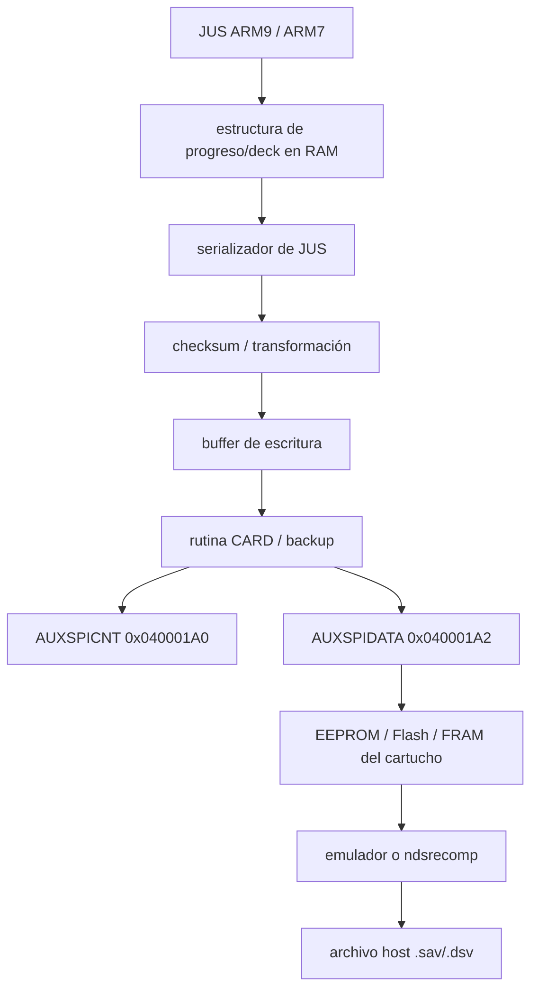
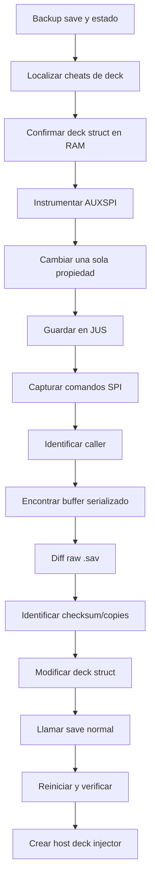

# Briefing técnico para el agente: arquitectura de guardados de Nintendo DS aplicada a JUS y ndsrecomp

## Resumen ejecutivo

Para **Jump Ultimate Stars**, la idea más importante es esta:

> **El archivo `.sav` no es una región de memoria de la Nintendo DS ni forma parte de la ROM. Es la representación en fichero de un chip de memoria no volátil separado que existe físicamente dentro del cartucho.**

En un cartucho NDS normal, el ARM7 o el ARM9 se comunica con ese chip mediante un **bus SPI serie del Slot-1**, usando principalmente `AUXSPICNT` (`0x040001A0`) y `AUXSPIDATA` (`0x040001A2`). El software envía comandos del estilo `WREN`, `READ`, `WRITE` y `RDSR`; no hace un `memcpy()` a una supuesta dirección de “save RAM”.    

Eso tiene consecuencias directas para la investigación de JUS:

```text
NO:

Deck
  ↓
write(0x0E000000, ...)
  ↓
save


SÍ:

Deck runtime struct en RAM
 ↓
serialización propia de JUS
 ↓
checksum / transformación propia de JUS
 ↓
buffer temporal
 ↓
rutina CARD/SPI
 ↓
AUXSPIDATA 0x040001A2
 ↓
EEPROM / FLASH del cartucho
 ↓
.sav en el emulador/host
```

La “encriptación” que se haya encontrado al editar el `.sav` **no debe confundirse con KEY1/KEY2 de los cartuchos DS**. KEY1/KEY2 pertenecen al protocolo de acceso al código/datos ROM del cartucho; el backup SPI usa su propio protocolo EEPROM/Flash. Si JUS transforma, cifra u ofusca sus datos antes de guardarlos, eso es una decisión del juego, no una función obligatoria del hardware DS.    

Para el objetivo concreto de **inyectar decks**, intentar descifrar primero todo el `.sav` probablemente sigue siendo una ruta secundaria. El atajo más prometedor es:

```text
Action Replay conocido
 +
deck runtime en RAM
 +
breakpoint en AUXSPIDATA
 ↓
encontrar estructura Deck
 ↓
encontrar serializador de JUS
 ↓
encontrar checksum
 ↓
encontrar SaveDeck / CommitSave
```

Además, como JUS ya funciona en vuestro `ndsrecomp`, hay un atajo adicional que no existe en una investigación puramente con emulador: se puede instrumentar el runtime y registrar **cada acceso al dispositivo de save con PC, CPU, LR, comando SPI, dirección y datos**, convirtiendo el problema en una traza determinista.

Hay una discrepancia importante en la documentación actual de `ndsrecomp`: el README reciente ya describe configuración por título mediante `[cartridge]`, `save_type` y `save_size`, mientras que `PLAN.md` todavía documenta una fase en la que el soporte era un EEPROM fijo de 8 KiB y persistencia host pendiente. Por ello, el agente **debe inspeccionar el commit/branch local de JUS y no asumir que el estado del README upstream coincide con el runtime que está ejecutando**.    

La prioridad práctica debería ser:

**primero identificar qué chip espera JUS; después localizar la rutina que serializa el estado; y sólo después decidir si merece la pena reproducir el `.sav` completo.**

## Arquitectura física del guardado en Nintendo DS

El término “save type” puede crear bastante confusión porque se mezclan tecnologías del **backup del juego**, tecnologías de la **ROM del cartucho**, y tecnologías heredadas de GBA.

### Tipos de almacenamiento relevantes

| Tecnología | Uso real en contexto NDS | Tamaños documentados / típicos | Acceso | Relevancia para JUS |
|---|---|---:|---|---|
| EEPROM serie | Backup/save de cartucho Slot-1 | 512 B, 8 KiB, 64 KiB, 128 KiB | SPI | Muy alta |
| Flash serie | Backup/save de cartucho Slot-1 | 256 KiB, 512 KiB, 1 MiB; existe 8 MiB en casos especiales | SPI | Muy alta |
| FRAM | Backup de algunos cartuchos | 8 KiB, 32 KiB documentados | SPI | Baja, pero existe |
| SRAM paralela | Muy habitual en GBA/Slot-2; no es el modelo normal de backup de Slot-1 NDS | variable | Bus paralelo GBA | No asumir para JUS |
| NOR / Mask ROM / 1T-ROM | Almacenamiento del **programa/recursos** del cartucho, no el save habitual | decenas/centenas de MiB según cartucho | Bus Gamecard paralelo | No confundir con `.sav` |
| NAND de cartucho | Algunos cartuchos especiales usan NAND escribible para almacenamiento del cartucho | título-dependiente | protocolo Gamecard, no el backup SPI normal | Excepcional |
| RTC | Reloj de la consola, no memoria de save | registros de fecha/hora | bus serie específico en ARM7 | Puede alimentar timestamps, pero no es `.sav` |

GBATEK documenta como backup SPI de DS EEPROM de 512 B, 8 KiB, 64 KiB y 128 KiB; Flash de 256 KiB, 512 KiB, 1 MiB e incluso un caso de 8 MiB; y FRAM de 8/32 KiB. También separa explícitamente este sistema del NAND del cartucho y de otras tecnologías de ROM.    

Por tanto, cuando una herramienta dice algo como:

```text
SRAM
FLASH
EEPROM
```

no hay que asumir que todas esas categorías representan literalmente el circuito utilizado por un cartucho retail de DS. Algunas herramientas y flashcarts utilizan nomenclaturas heredadas o formatos uniformes de `.sav`.

### El juego sabe qué protocolo utilizar

No existe una “unidad de disco” ni un filesystem estándar dentro del backup del cartucho.

Conceptualmente, JUS hace algo equivalente a:

```c
save_write(offset, data, length);
```

pero debajo eso termina convirtiéndose en transacciones SPI.

Para EEPROM de 8–64 KiB, por ejemplo, GBATEK documenta:

```text
06 WREN
02 AA AA DD ... WRITE
05 RDSR
03 AA AA READ
```

donde `AA AA` es la dirección. La EEPROM pequeña de 512 bytes utiliza comandos/direccionamiento ligeramente diferentes. Flash incorpora además operaciones propias de flash, estados de escritura y, según dispositivo, borrado de sectores/páginas.   

La información clave para reverse engineering es que los bytes:

```text
06
04
05
01
03
02
```

son excelentes firmas.

Especialmente:

```text
0x06 = Write Enable
0x05 = Read Status Register
0x03 = Read
0x02 = Write
```

No significa que buscar literalmente `02 03 05 06` encuentre la función, porque pueden cargarse como inmediatos separados, tablas o constantes, pero son pistas muy valiosas.   

### Registros hardware que interesan

El punto central es:

| Dirección | Registro | Función |
|---:|---|---|
| `0x040001A0` | `AUXSPICNT` | Control del SPI de backup |
| `0x040001A2` | `AUXSPIDATA` | Byte enviado/recibido por SPI |
| `0x040001A4` | `ROMCTRL` | Transferencias del bus ROM/Gamecard |
| `0x040001A8` | Gamecard command | Comando de 8 bytes para ROM |
| `0x04100010` | Gamecard data | Datos del bus paralelo |
| `0x04000138` | RTC | Interfaz del reloj, sólo lado ARM7 |

En `AUXSPICNT`, los bits `0–1` seleccionan aproximadamente 4 MHz, 2 MHz, 1 MHz o 512 kHz; el bit 6 mantiene activo chip-select; el bit 7 informa de busy; el bit 13 selecciona modo SPI-backup frente al bus ROM; y el bit 15 habilita el Slot-1. Una escritura en `AUXSPIDATA` inicia una transferencia; incluso para leer se escribe un byte dummy y después se recoge el byte recibido.   

Esto hace que el breakpoint más poderoso para guardar sea:

```text
WRITE 0x040001A2
```

y no una búsqueda aleatoria por RAM.

### ARM7 frente a ARM9

Los registros del cartucho pueden estar asignados al ARM7 o al ARM9; la propiedad del bus se controla mediante la lógica de memoria externa/`EXMEMCNT`. GBATEK documenta explícitamente que los registros Gamecard se pueden mapear a cualquiera de los dos procesadores.   

Por eso el agente no debe presuponer:

```text
save = ARM7
```

ni:

```text
save = ARM9
```

Hay que observar quién realiza realmente las escrituras en JUS.

En `ndsrecomp` esto es todavía más sencillo: registrar:

```text
active_cpu
guest_pc
guest_lr
address
value
timestamp/cycle
```

cuando se escribe en `AUXSPIDATA`.

Una sola operación “Guardar” puede revelar inmediatamente qué CPU contiene el código interesante.

### No buscar una syscall BIOS de “SaveGame”

La abstracción habitual de homebrew, como la expuesta por libnds, ofrece funciones del tipo `cardWriteEeprom()`, `cardEepromReadID()`, `cardEepromGetType()`, `cardEepromGetSize()` y operaciones de borrado. Esas funciones constituyen una capa de software sobre el acceso al cartucho; no existe una filesystem API de BIOS que convierta automáticamente estructuras del juego en saves.    

Para JUS, por tanto, es más útil buscar:

```text
MMIO -> SPI -> CARD code
```

que buscar una hipotética syscall `SaveGame()`.

### RTC

El RTC tampoco es almacenamiento del cartucho. La DS tiene un Seiko S-35180/compatible conectado a una interfaz serie expuesta en `0x04000138` del ARM7, con comandos para fecha, hora, alarmas y registros de estado. Un juego puede leer el RTC y guardar una copia de la fecha dentro de su save, pero ese timestamp pasa a ser simplemente datos ordinarios del `.sav`.   

El agente debe mantener separados:

```text
RTC
│
├── fecha/hora actual
│
└── puede alimentar campos del save


Backup SPI
│
└── bytes persistentes del juego
```

### Flujo completo



La parte **B → D** es propiedad de JUS. La parte **F → I** es la interfaz hardware de Nintendo DS. Esa separación debería guiar toda la investigación.    

## Layout lógico del `.sav`, checksums y emulación

### No existe un formato universal de `.sav`

Ésta es probablemente la segunda observación más importante después del SPI:

> **Nintendo DS define cómo acceder al chip; no define cómo un juego debe organizar su contenido.**

La dirección `0` del `.sav` exportado corresponde, normalmente, a la dirección `0` del backup bruto. A partir de ahí, la estructura es del título. El hecho de que los emuladores puedan representar el backup como un array bruto de bytes es precisamente consecuencia de ese modelo de chip.    

Por tanto, no existe algo universal como:

```text
offset 0x0000 = DS save header
offset 0x0100 = player
offset 0x0200 = decks
```

Para JUS hay que descubrirlo.

### Patrones que el agente debe probar

Los siguientes **no son requisitos NDS**; son hipótesis de reverse engineering razonables para un título comercial y deben validarse experimentalmente:

```text
[magic/version]
[save counter / generation]
[options]
[progress]
[unlocks]
[decks]
[checksum]
```

o:

```text
COPY A
0x0000 ────────────────────────┐
 │
COPY B │ redundancia
0x8000 ────────────────────────┘
```

Un esquema habitual de tolerancia a cortes de corriente consiste conceptualmente en mantener copias o bloques con contador/version/checksum y escoger la copia válida más reciente. No hay que asumir que JUS lo hace hasta demostrarlo.

Para identificarlo, la prueba más potente es generar saves controlados:

```text
S0 = save limpio

S1 = S0 + cambiar una opción

S2 = S1 + desbloquear exactamente una cosa

S3 = S2 + modificar exactamente un deck

S4 = S3 + modificar sólo el nombre del deck
```

y calcular:

```text
diff(S0,S1)
diff(S1,S2)
diff(S2,S3)
diff(S3,S4)
```

Si la misma modificación aparece dos veces separada por una distancia fija, sospechar copias redundantes.

Si cambia una zona grande aparentemente aleatoria después de modificar un solo byte lógico, sospechar:

```text
checksum
cifrado por bloque
compresión
permutación
o contador usado como seed
```

pero **no llamarlo “encryption” todavía**.

### Checksums que merece la pena buscar

En Ghidra o en los bancos recompiled conviene buscar primero patrones baratos:

| Hipótesis | Pista |
|---|---|
| suma de bytes/words | bucle `add` sobre rango continuo |
| complemento | suma seguida de `~x` / `neg` |
| XOR acumulativo | bucle `eor` |
| CRC-16 CCITT | posible `0x1021` |
| CRC-16 reflejado | posible `0x8408` |
| CRC-16 IBM | posible `0xA001` |
| CRC-32 | posible `0xEDB88320` |
| tabla CRC | tabla de 256 halfwords/words con alta entropía estructurada |
| XOR/stream sencillo | XOR de datos con estado que evoluciona |
| LCG | multiplicación + suma recurrente |

Son **signaturas de búsqueda, no prueba de formato**. Un CRC puede estar implementado con tabla y no contener el polinomio visible; un algoritmo puede venir de una función común del SDK.

Para JUS, el agente debería intentar encontrar primero la función que **verifica** el save. Es frecuentemente más fácil seguir:

```text
Load save
 ↓
calculate(...)
 ↓
compare saved_value
 ↓
valid / corrupt
```

que inferir matemáticamente el checksum sólo con hex dumps.

### No confundir KEY1/KEY2 con cifrado del `.sav`

`ROMCTRL` contiene bits relacionados con KEY2 para comandos/datos de acceso al cartucho ROM; esos mecanismos pertenecen al bus principal de Gamecard. El backup EEPROM/Flash se accede por `AUXSPIDATA` con sus comandos SPI.    

Esto significa que una investigación que empiece buscando:

```text
Nintendo DS KEY1 decrypt save
Nintendo DS KEY2 save encryption
```

está atacando, en principio, el problema equivocado.

### melonDS

melonDS modela el cartucho y su memoria de backup como un dispositivo emulado y utiliza datos de tipo/tamaño de save asociados al ROM. Su implementación mantiene el contenido del save en el host y tiene una ruta explícita de escritura/flush de las regiones modificadas; su documentación también trata los saves externos como backup raw importable.    

Esto ofrece dos niveles de observación:

```text
Nivel título:
RAM de JUS
↓
serializador


Nivel dispositivo:
comandos SPI
↓
array de save emulado
↓
archivo .sav
```

Para reverse engineering de JUS conviene observar ambos.

### DeSmuME

DeSmuME utiliza internamente `.dsv` para sus saves y dispone de **Import Backup Memory** y **Export Backup Memory** para intercambiar formatos de backup. La propia documentación recomienda exportar/importar el backup en lugar de tratar un `.dsv` como si fuese necesariamente un `.sav` raw de otro emulador.    

Para producir dumps comparables:

```text
DeSmuME
File → Export Backup Memory
 ↓
 RAW save
```

es preferible a modificar a ciegas el `.dsv`.

Un savestate tampoco es equivalente a un save de cartucho; DeSmuME distingue explícitamente los archivos de guardado persistente de los estados completos del emulador.   

### El “save en RAM” no es el chip de save

Esto debe quedar muy claro para el agente:

```text
0x020xxxxx
```

puede contener una **copia de trabajo** del progreso/decks.

Pero:

```text
EEPROM offset 0x1234
```

no significa:

```text
CPU address 0x02001234
```

El chip sólo es alcanzable mediante SPI.

Éste es justamente el motivo por el que un Action Replay normal puede modificar el deck en RAM pero no “escribir al EEPROM” simplemente apuntando un `E` code a un offset del `.sav`.    

### ndsrecomp: qué inspeccionar inmediatamente

El README actual de `ndsrecomp` documenta configuración:

```toml
[cartridge]
save_type = "eeprom" # none | eeprom-tiny | eeprom | flash
save_size = 8192
```

y recomienda que títulos comerciales declaren el tipo/tamaño correcto según una base de datos fiable.   

Sin embargo, `PLAN.md` conserva documentación que describe el soporte de save como un EEPROM fijo de 8 KiB y la persistencia host `.sav` como trabajo pendiente.   

Dado que el usuario ha confirmado que **su build de JUS arranca y juega pero actualmente no persiste saves**, el agente debe resolver el estado real del branch con código, no con documentación:

```text
grep/search:

save_type
save_size
eeprom
eeprom-tiny
flash
AUXSPI
AUXSPICNT
AUXSPIDATA
0x040001A0
0x040001A2
WriteNDSSave
RequestFlush
save_path
.sav
cartridge
backup
```

La pregunta inicial concreta es:

> ¿El branch de JUS ya emula correctamente el protocolo que espera JUS pero no persiste el backing store, o está emulando el chip/tamaño incorrecto y JUS nunca completa correctamente su secuencia de guardado?

Esas son averías completamente distintas.

## Action Replay como herramienta de reverse engineering

Action Replay es particularmente útil aquí porque sus códigos antiguos pueden señalar directamente **variables y estructuras runtime de JUS**.

Pero hay que hacer una corrección terminológica: los writes estándar de AR DS son de **8, 16 y 32 bits**, no 9, 16 y 32. El tipo `0x09` es un **condicional de 16 bits con máscara**, no una escritura de 9 bits.   

### Tipos importantes

| Tipo | Forma | Efecto |
|---|---|---|
| `0` | `0XXXXXXX YYYYYYYY` | write 32-bit |
| `1` | `1XXXXXXX 0000YYYY` | write 16-bit |
| `2` | `2XXXXXXX 000000YY` | write 8-bit |
| `3–6` | condicionales | comparaciones 32-bit |
| `7–A` | condicionales | comparaciones 16-bit/máscara |
| `B` | pointer/offset | carga offset desde memoria |
| `C` | loop | establece repetición |
| `D0` | terminador condicional | restaura estado de ejecución |
| `D2` | full terminator | finaliza/reset temporales |
| `D3` | offset | fija offset |
| `D5` | data register | establece dato |
| `D6` | write incremental | 32-bit y `offset += 4` |
| `D7` | write incremental | 16-bit y `offset += 2` |
| `D8` | write incremental | 8-bit y `offset += 1` |
| `D9/DA/DB` | loads | carga 32/16/8 bit |
| `E` | patch/data block | copia N bytes inline a RAM |
| `F` | memory copy | copia una región de memoria |

La documentación técnica de Kodewerx especifica estos tipos y, en particular, define `E` como una copia de `N` bytes del stream de códigos a `[address + offset]`.    

### Lo que realmente hace un E-block

Supongamos que descubrimos:

```text
Deck runtime address = 0x020A1000
Deck size = 0x40
```

Entonces conceptualmente:

```text
E20A1000 00000040
<data 64 bytes>
```

permite escribir de golpe esa estructura.

El flujo es:


Ésta es una estrategia **muy superior a intentar hacer que Action Replay escriba directamente un `.sav`**.

AR escribe el espacio de memoria de CPU. El backup SPI no es una región lineal de RAM; para persistir el resultado, JUS debe ejecutar después su rutina normal de save, o el código inyectado debe llamar explícitamente a esa rutina.    

### Receta para generar un E-block

Una vez conocido `address` y los bytes exactos:

1. Validar que `address` pertenece a una estructura runtime estable en esa revisión concreta de JUS.
2. Generar:
 ```text
 EAAAAAAA NNNNNNNN
 ```
 con la dirección y longitud.
3. Empaquetar el payload en palabras compatibles con el orden little-endian del ARM.
4. Rellenar únicamente la última línea del stream según sea necesario; `N` debe contener la longitud real.
5. Añadir un activador de botones si se desea evitar sobrescribir continuamente la estructura.
6. Ejecutar el código sólo en un estado seguro, por ejemplo dentro del selector/editor de decks.
7. Pedir a JUS que guarde normalmente.
8. Reiniciar completamente el juego y comprobar persistencia.

Por ejemplo, para los bytes:

```text
12 34 56 78  9A BC DE F0
```

una herramienta generadora debe tratarlos como palabras little-endian:

```text
0x78563412
0xF0DEBC9A
```

en vez de confiar en concatenación textual.

El agente debería crear inmediatamente:

```text
tools/deck_to_ar.py
```

con una interfaz similar a:

```bash
python tools/deck_to_ar.py \
 --address 0x020A1000 \
 --input deck.bin
```

y salida:

```text
E20A1000 00000040
........ ........
........ ........
...
```

El generador debe verificar:

```text
decode(generate(payload)) == payload
```

antes de utilizar el cheat.

### Activadores y condición

Kodewerx documenta `0x04000130` como una dirección universal de teclas y muestra activadores AR que sólo ejecutan el bloque al pulsar una combinación determinada.   

Eso permite una herramienta de investigación mucho más segura:

```text
IF L+R+Select
 E-block deck
END
```

en lugar de sobrescribir la estructura cada frame.

### Los cheats antiguos de JUS deben tratarse como símbolos de depuración

Todo Action Replay de JUS relacionado con:

```text
unlock all koma
unlock preset decks
deck slot
selected deck
use deck XX
80 decks
deck editor
leader
support koma
```

debe transformarse en una tabla:

```text
AR address
↓
guest RAM address
↓
xrefs en código
↓
hipótesis semántica
```

Por ejemplo, un código que modifica un bitfield de desbloqueos puede llevar desde:

```text
progress.unlockedKoma
```

hasta:

```text
IsKomaUnlocked()
```

y desde ahí a:

```text
LoadPresetDeck()
GetDeck()
ValidateDeck()
```

El Action Replay no elimina la necesidad de reverse engineering; **reduce drásticamente el espacio de búsqueda**.

## Workflow de reverse engineering para JUS

El agente debería trabajar en dos frentes simultáneos: **desde arriba**, siguiendo los decks y cheats; y **desde abajo**, siguiendo el SPI.

La intersección de ambos es el serializador del save.

### Ruta ascendente: deck → save

Primero localizar:

```text
Deck runtime struct
```

mediante cheats conocidos, editor de decks y referencias.

Después:

```text
Deck struct
 ↓
quién lo copia al guardar
 ↓
buffer de save
 ↓
checksum/serialización
```

### Ruta descendente: SPI → código de JUS

Instrumentar:

```text
0x040001A0
0x040001A2
```

y realizar exactamente una operación de guardado.

La traza deseada sería algo parecido a:

```text
CPU=ARM9
PC=0x02061A84
write AUXSPICNT 0xA040

CPU=ARM9
PC=0x02061AB0
write AUXSPIDATA 0x06 ; WREN

CPU=ARM9
PC=0x02061B04
write AUXSPIDATA 0x02 ; WRITE
write AUXSPIDATA 0x12 ; address
write AUXSPIDATA 0x80
write AUXSPIDATA 0x4A ; payload...
...
```

Eso sería suficiente para decir:

```text
0x02061xxx ≈ backup write implementation
```

y empezar a subir por callers.

### Experimento de breakpoint/watchpoint

Hacer un backup de todo antes de la prueba.

Estado inicial:

```text
sav_baseline.raw
savestate_before_save
RAM dump
```

Después:

1. Breakpoint/log de escritura a `0x040001A0` y `0x040001A2`.
2. Iniciar el juego.
3. Cambiar **una sola propiedad** de un deck.
4. Pulsar Guardar.
5. Registrar la secuencia SPI completa.
6. Para cada transacción, registrar:
 ```text
 CPU
 PC
 LR
 SP
 r0-r12
 AUXSPICNT
 byte TX
 byte RX
 cycles
 ```
7. Agrupar los bytes por chip-select.
8. Reconstruir:
 ```text
 command
 address
 payload
 ```
9. Colocar breakpoint en el caller que proporciona el payload.
10. Seguir hacia atrás hasta el buffer de JUS.
11. Comparar ese buffer con el diff del `.sav`.
12. Repetir modificando otra única propiedad.

Gracias a comandos como `WREN`, `READ`, `WRITE` y `RDSR`, una captura SPI debería ser relativamente sencilla de segmentar.   

### Mejor todavía: instrumentarlo en ndsrecomp

Como el título ya funciona recompilado, no hay razón para depender exclusivamente del debugger de DeSmuME.

Añadir temporalmente al write handler:

```cpp
if (addr == 0x040001A0 || addr == 0x040001A2) {
 log_save_io(
 active_cpu,
 guest_pc,
 guest_lr,
 addr,
 value,
 scheduler_cycles
 );
}
```

No es código exacto para el repo; el agente deberá adaptarlo a las abstracciones locales.

Idealmente producir:

```text
logs/jus_save_spi.jsonl
```

con:

```json
{
  "cpu": "arm9",
  "pc": "0x02061AB0",
  "lr": "0x02048128",
  "reg": "AUXSPIDATA",
  "tx": "0x06",
  "cycle": 192883445
}
```

Después un parser:

```text
tools/decode_save_spi.py
```

debe convertirlo en:

```text
TX #41
WREN

TX #42
WRITE address=0x1280 length=32
data=...
```

Esta herramienta sería extremadamente valiosa para JUS y para cualquier otro título de `ndsrecomp`.

### Timeline experimental



### Buscar en Ghidra / generated code

Tabla de búsqueda inicial:

| Buscar | Motivo |
|---|---|
| `0x040001A0` | `AUXSPICNT` |
| `0x040001A2` | `AUXSPIDATA` |
| `0x040001A4` | `ROMCTRL`, distinguir ROM de backup |
| `0x04000138` | RTC; evitar confundirlo con save |
| `0x06` cerca de SPI | `WREN` |
| `0x05` cerca de SPI | `RDSR` |
| `0x03` cerca de SPI | `READ` |
| `0x02` cerca de SPI | `WRITE` |
| `0x1021` | posible CRC16 |
| `0x8408` | posible CRC16 reflejado |
| `0xA001` | posible CRC16 IBM |
| `0xEDB88320` | posible CRC32 |
| `CARD` | símbolos/strings SDK si sobreviven |
| `EEPROM`, `FLASH` | idem |
| `save`, `backup` | runtime/recompiler host |
| direcciones de cheats JUS | acceso directo a progresión/decks |
| direcciones de deck encontradas | xrefs a funciones de deck |

No asumir que un literal MMIO aparecerá directamente en una función recompiled. Puede haber:

```text
literal pool
wrapper bus_write
SDK function
pointer construido con mov/orr
```

Por eso combinar búsqueda estática con traza dinámica será más rápido.

### Receta para capturar lectura del save

Hacer lo mismo al arrancar:

```text
cold boot
↓
primer READ 0x03
↓
seguir caller
↓
ver dónde acaba el payload
```

Esto es particularmente interesante porque probablemente lleva a:

```text
ReadBackup()
↓
ValidateSave()
↓
DeserializeProgress()
↓
LoadDecks()
```

La función `ValidateSave()` puede resolver el supuesto “encryption problem” mucho antes que estudiar el `.sav` externamente.

### Receta para reconstruir el save desde el host

Importante corrección conceptual:

> **No se extraen los bloques de save de la ROM `.nds`.**

Son dos almacenamientos separados.

La ruta correcta es:

```text
ROM JUS.nds
 +
backup chip JUS
 ↓
raw JUS.sav
```

En emulador:

```text
melonDS raw save
o
DeSmuME → Export Backup Memory
```

Después, para `ndsrecomp`, hay dos posibles arquitecturas.

**Arquitectura fiel al hardware:**

```text
JUS recompiled
 ↓
AUXSPI
 ↓
emulated EEPROM/Flash
 ↓
save_backing_buffer[]
 ↓
atomic host flush
 ↓
JUS.sav
```

Ésta es la mejor solución general.

**Arquitectura específica de JUS:**

```text
hook JUS Save/Load
 ↓
host read/write
 ↓
JUS.sav / deck database
```

Es potencialmente mucho más rápida para vuestro proyecto, pero pierde fidelidad hardware.

Mi recomendación sería mantener ambas ideas separadas:

```text
ndsrecomp core:
 implementar backup correctamente

JUS enhancement:
 Deck import/export a nivel de estructura del juego
```

El injector de decks no debería depender de que el usuario entienda el formato físico del EEPROM.

## Mandato operativo para el agente y entregables

El siguiente bloque puede utilizarse directamente como briefing para el agente que ya conoce el codebase.

> **Objetivo**
>
> Investiga el sistema de save de Jump Ultimate Stars con el propósito inmediato de poder inyectar decks de forma fiable y, como objetivo secundario, implementar persistencia correcta del `.sav` en el build de `ndsrecomp`.
>
> No empieces intentando “decrypt the whole save”. Determina primero el dispositivo de backup que JUS espera, identifica el camino runtime `Deck → serializer → checksum/transform → backup SPI`, y decide después cuánto del formato de save hace falta comprender.
>
> **Modelo hardware que debes asumir**
>
> El backup normal de un cartucho Nintendo DS no es RAM mapeada. EEPROM/Flash/FRAM se controlan por el SPI de Gamecard mediante `AUXSPICNT=0x040001A0` y `AUXSPIDATA=0x040001A2`. Busca y registra comandos `0x06 WREN`, `0x05 RDSR`, `0x03 READ`, `0x02 WRITE`, además de cualquier erase/status command que aparezca. El bus puede pertenecer al ARM7 o ARM9, por lo que debes inspeccionar ambos.    
>
> **No confundas** KEY1/KEY2 del ROM/Gamecard con el formato del save. Cualquier cifrado/ofuscación de los bytes del `.sav` será lógica de JUS hasta que exista evidencia en sentido contrario.   
>
> **Primera tarea**
>
> Inspecciona el branch local de `ndsrecomp` y determina exactamente qué soporte de backup contiene. Busca `save_type`, `save_size`, `eeprom`, `flash`, `AUXSPI`, `WriteNDSSave`, `RequestFlush`, `.sav`, `0x040001A0` y `0x040001A2`. No confíes sólo en upstream: el README actual documenta configuración por chip/tamaño pero `PLAN.md` conserva una descripción anterior de EEPROM fijo de 8 KiB y persistencia pendiente. Documenta cuál corresponde al commit que utiliza JUS.    
>
> **Segunda tarea**
>
> Determina el chip y tamaño que espera JUS. No adivines ni uses automáticamente 512 KiB porque un flashcart genere saves de ese tamaño. Compruébalo mediante una base de datos de cartuchos fiable, comportamiento real del juego, los comandos SPI emitidos y/o las rutinas de detección.
>
> **Tercera tarea**
>
> Instrumenta el runtime para producir una traza completa de toda escritura a `AUXSPICNT/AUXSPIDATA`. Cada evento debe registrar CPU, guest PC, LR, valor y cycle/timestamp. Escribe un decoder que agrupe bytes por chip-select y reconozca transacciones EEPROM/Flash.
>
> Entregable:
>
> ```text
> tools/decode_save_spi.py
> logs/jus_save_spi.jsonl
> research/jus_backup_protocol.md
> ```
>
> **Cuarta tarea**
>
> Realiza un cold boot y captura las primeras lecturas del backup. Sigue el caller desde el SPI hacia arriba hasta encontrar:
>
> ```text
> BackupRead
> ↓
> ValidateSave
> ↓
> DeserializeSave
> ↓
> Progress/Deck RAM
> ```
>
> Nombra funciones sólo cuando exista evidencia. Mantén dirección ARM/Thumb, CPU, callers y nivel de confianza.
>
> **Quinta tarea**
>
> Utiliza todos los Action Replay existentes de JUS como símbolos. Decodifica códigos de tipo `0/1/2`, loops `C`, registro `D5`, writes incrementales `D6-D8`, offsets y E-blocks. Cualquier cheat de `deck`, `preset deck`, `unlock deck`, `selected deck`, `80 decks`, `koma` o `leader` debe convertirse en una dirección RAM y después buscarse en xrefs del código. Los tipos AR estándar escriben 8/16/32 bits; un E-block copia un bloque arbitrario de bytes a RAM.    
>
> Entregable:
>
> ```text
> research/jus_ar_map.md
>
> Address Cheat Hypothesis Confidence
> -----------------------------------------------------------------------
> 0x02...... Unlock ... unlock bitfield ...
> 0x02...... Use deck ... selected deck index ...
> ```
>
> **Sexta tarea**
>
> Localiza la estructura runtime de un deck. Confírmala experimentalmente cambiando una única propiedad:
>
> ```text
> koma ID
> position
> leader
> L shortcut
> R shortcut
> name
> ```
>
> El criterio de éxito no es encontrar bytes correlacionados, sino cambiar esos bytes y observar que JUS interpreta correctamente el deck.
>
> **Séptima tarea**
>
> Una vez conocida la estructura, identifica qué función la lee al guardar. Usa un breakpoint/watchpoint en el buffer serializado y correlaciónalo con la transacción `WRITE 0x02` observada en SPI.
>
> Debes poder producir este mapa:
>
> ```text
> Deck runtime struct
> address = ...
> size = ...
> ↓
> FUN_020xxxxx  candidate SerializeDeck
> ↓
> save block @ offset ...
> ↓
> FUN_020xxxxx  candidate checksum
> ↓
> FUN_020xxxxx  backup write
> ↓
> AUXSPIDATA
> ```
>
> **Octava tarea**
>
> Exporta raws controlados:
>
> ```text
> S0 baseline
> S1 + una opción
> S2 + un unlock
> S3 + un solo cambio de deck
> S4 + sólo nombre
> ```
>
> Haz diff por byte y por bloques, detecta regiones duplicadas y busca contadores/checksums. No presupongas un header estándar: NDS no impone layout interno del save.
>
> **Novena tarea**
>
> Busca funciones de checksum a partir del call path antes de atacar matemáticamente los dumps. Como heurísticas, comprueba sums/XOR y firmas `0x1021`, `0x8408`, `0xA001` y `0xEDB88320`. Si un único cambio modifica gran parte de un bloque, analiza también XOR rolling, LCG, permutación o cifrado por bloque, pero documenta esas posibilidades como hipótesis.
>
> **Décima tarea**
>
> Cuando conozcas `DeckAddress` y `DeckSize`, crea:
>
> ```text
> tools/deck_to_ar.py
> ```
>
> que convierta un `deck.bin` en un AR E-block:
>
> ```text
> E<address> <length>
> <payload>
> ```
>
> Debe hacer round-trip del payload para comprobar endianness. Añade opcionalmente un activador de botones. Usa el código para modificar RAM y después llama/activa el guardado normal de JUS; no intentes representar un offset EEPROM como dirección RAM.    
>
> **Undécima tarea**
>
> Cuando se identifique la función de commit de JUS, crea un proof of concept en `ndsrecomp`:
>
> ```text
> external deck JSON
> ↓
> converter
> ↓
> JusDeck runtime struct
> ↓
> game-native validation
> ↓
> game-native Save/Commit
> ```
>
> Si es posible, reutiliza las funciones originales recompiled del juego en vez de reimplementar checksum/serialización a mano.
>
> **Duodécima tarea**
>
> En paralelo, corrige persistencia física del backup de `ndsrecomp` mediante un backing buffer host del tamaño/tipo adecuado y flush atómico a `.sav`. Mantén esta funcionalidad separada del deck importer. El README upstream actual ya expone configuración `[cartridge]`, pero verifica qué está implementado realmente en el branch local.    
>
> **Pruebas de aceptación**
>
> Una investigación no está terminada hasta que se puedan demostrar, de manera reproducible, estas cuatro cosas:
>
> ```text
> A. cambiar Deck struct en RAM cambia el deck visible;
>
> B. guardar produce una secuencia SPI comprendida;
>
> C. se conoce el camino de funciones entre Deck y SPI;
>
> D. después de cold boot, el deck inyectado persiste y JUS lo acepta
> sin mensaje de corrupción.
> ```
>
> **Disciplina experimental**
>
> Nunca modificar dos propiedades a la vez. Mantener copias de cada `.sav`. Utilizar cold boots además de savestates. No usar un único emulador como oracle: contrastar melonDS, DeSmuME y `ndsrecomp`. melonDS utiliza un modelo real de dispositivo de cartucho y DeSmuME permite importar/exportar backup memory, por lo que ambos son útiles para obtener referencias independientes.    
>
> **Documentación que debes mantener**
>
> ```text
> research/
> jus_backup_protocol.md
> jus_save_layout.md
> jus_save_functions.md
> jus_deck_struct.md
> jus_ar_map.md
> experiments.md
>
> tools/
> decode_save_spi.py
> diff_saves.py
> deck_to_ar.py
> inspect_save_blocks.py
> ```
>
> Cada hallazgo debe incluir:
>
> ```text
> evidence
> guest address
> ARM7/ARM9
> callers
> observed inputs
> observed outputs
> experiment that confirmed it
> confidence: low/medium/high
> ```
>
> **Orden de prioridad**
>
> ```text
> P0  determinar tipo/tamaño de backup de JUS
> P0  instrumentar AUXSPI
> P0  localizar runtime Deck
> P0  localizar write/commit path
> P1  identificar serialized deck block
> P1  identificar checksum/validation
> P1  proof-of-concept deck injection
> P1  persistencia .sav en ndsrecomp
> P2  documentar save completo
> P3  recrear encoder/checksum externamente
> ```
>
> No inviertas tiempo en descifrar campos del save que no sean necesarios para importar decks.

Las fuentes que el agente debería priorizar son **GBATEK/no$gba para el hardware Slot-1, backup SPI y RTC**; **libnds/BlocksDS para una implementación abierta de las operaciones de cartucho**; **el propio source de melonDS para un modelo de referencia del dispositivo y persistencia**; **DeSmuME para una segunda implementación y exportación/importación de backup**; **el código/documentación del propio `ndsrecomp` para saber exactamente qué se emula en el branch local**; y **Kodewerx EnHacklopedia para la semántica de los code types Action Replay**.         

La conclusión operativa para JUS es especialmente favorable: **no hace falta “crackear el `.sav`” como una caja negra para poder importar decks**. Encontrar el deck runtime, seguir una única operación de guardado hasta `0x040001A2` y reutilizar las funciones originales de serialización/validación de JUS puede convertir un problema de criptografía desconocida en un problema mucho más acotado de trazado de funciones y estructuras.    